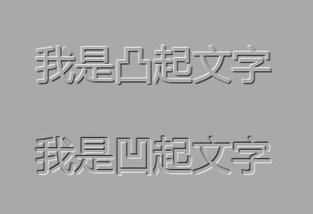

作者：HConan
日期：2019-03-29

相关说明：ConanCssDemoDay1.html涵盖示例

目录
* [1. CSS语法结构](#CSS语法结构)
	* [1.1 CSS整体重点](#CSS整体重点)
	* [1.2 CSS作用](#CSS作用)
	* [1.3 CSS概念](#CSS概念)
	* [1.4 CSS层叠](#CSS层叠)
	* [1.5 CSS注意点](#CSS注意点)
	* [1.6 CSS书写方式](#CSS书写方式)
		* [1.6.1 内嵌式写法](#内嵌式写法)
		* [1.6.2 外联式写法](#外联式写法)
		* [1.6.3 行内式写法](#行内式写法)
* [2. 选择器](#选择器)
	* [2.1 基础选择器](#基础选择器)
		* [2.1.1 标签选择器](#标签选择器)
		* [2.1.2 类选择器](#类选择器)
		* [2.1.3 ID选择器](#ID选择器)
		* [2.1.4 通配符选择器](#通配符选择器)
	* [2.2 复合选择器（交集选择器）](#复合选择器)
		* [2.2.1 标签指定式选择器](#标签指定式选择器)
		* [2.2.2 后代选择器](#后代选择器)
		* [2.2.3 子代选择器](#子代选择器)
		* [2.2.4 并集选择器](#并集选择器)
		* [2.2.5 属性选择器](#属性选择器)
		* [2.2.6 伪类选择器](#伪类选择器)
			* [2.2.6.1 结构伪类](#结构伪类)
			* [2.2.6.2 伪元素](#伪元素)
* [3. style中的属性](#style中的属性)
	* [3.1 常见属性总结](#常见属性总结)
	* [3.2 背景及透明效果](#背景及透明效果)
	* [3.3 阴影相关](#阴影相关)
	* [3.4 常见属性总结](#常见属性总结)

# CSS

<span id="CSS语法结构"></span>
## 1. CSS语法结构

<span id="CSS整体重点"></span>
### 1.1 CSS整体重点
	1. 选择器
	2. 盒子模型
	3. 浮动
	4. 定位
	CSS中扩充部分：
		5. 动画
		6. 伸缩布局

<span id="CSS作用"></span>
### 1.2 CSS作用
	1. 美化网页（通过CSS控制标签的样式）
	2. 网页布局（通过CSS控制标签的位置）

<span id="CSS概念"></span>
### 1.3 CSS概念
	层叠样式表（Cascading Style Sheets）或者级联样式表
	
<span id="CSS层叠"></span>
### 1.4 CSS层叠
	CSS的特性
	
<span id="CSS注意点"></span>
### 1.5 CSS注意点
	CSS是以html为基础
	
<span id="CSS书写方式"></span>
### 1.6 CSS书写方式

<span id="内嵌式写法"></span>
#### 1. 1.6.1 内嵌式写法
(在head标签中使用style标签且在style标签中写CSS代码)
```html
<head>
	<meta charset="UTF-8">
	<title>内嵌式</title>
	<!-- 内嵌式写法 -->
	<style type="text/css">
		 css代码
	</style>
</head>
```

<span id="外联式写法"></span>
#### 2. 1.6.2 外联式写法
(在head标签中使用link标签 rel="stylesheet")
```html
<head>
	<meta charset="UTF-8">
	<title>Document</title>
	<!-- 外联式写法 -->
	<link rel="stylesheet" href="1.css">
</head>
```

<span id="行内式写法"></span>
#### 3. 1.6.3 行内式写法
```html
<body>
	<!-- 行内式写法 -->
	 <p style=""></p>
</body>
```

<span id="选择器"></span>
## 2. 选择器

<span id="基础选择器"></span>
### 2.1 基础选择器

<span id="标签选择器"></span>
#### 2.1.1. 标签选择器
作用：
通过html标签名选中需要设置样式的标签
```html
<style type="text/css">
	/* 将页面中所有的p标签选中，设置文字颜色为红色 */
	p {
		color: blanchedalmond;
	}
	
	div {
		 /* 文字颜色为红色 */
		color: yellow; 
		/* 标签的宽度是200像素 */
		width: 400px;
		/* 标签的高度是200像素 */
		height: 300px;
		/* 标签的背景颜色为绿色 */
		background-color: blueviolet;
	}

	input {
		color: red;
		background-color: blanchedalmond;
	}
</style>
```

<span id="类选择器"></span>
#### 2.1.2. 类选择器
说明：
	1. 一个标签可以调用多个类样式
	2. 一个类样式可以被多个标签同时调用

命名规则：
	1. 不能以纯数字 or 数字开头
	2. 不推荐使用汉字定义类名
	3. 不能使用特殊字符或者以特殊字符开头（$、#、%等)
	4. 建议不推荐标签名作为类名

推荐命名方式：

	一般我们用具有一定语义的单词或者汉语拼音去定义一个类名，如下：
	头: header
	内容:content/container
	尾:footer
	侧栏:sidebar
	导航:nav
	标志:logo
	广告:banner
	页面主体:main
	内容:content 

```html
<style type="text/css">

	/* 选中类名是test的标签 */
	.test {
		color: red;
	}

	.test1 {
		color: green;
	}
	
	/* 不推荐使用 */
	.文字颜色 {
		 color: red;
	}
</style>

<p class="test">段落2</p>
<span class="test1">文字</span>
<div class="test test1">div1</div>

<p class="文字颜色">段落1</p>
```

<span id="ID选择器"></span>
#### 2.1.3. ID选择器
与类选择器的区别：
	1. 语法定义有区别，是用#,不是用.
	2. 在ID选择器中，一个标签只能调用一个ID样式
	3. 一个类样式可以被多个标签调用，但是一个ID样式最好只能被一个标签调用（否则，不符合编程规则）
```html
<style type="text/css">
 /* 将页面中标签的id属性值是public的标签选中 */
	#public {
		 color: red;
	}
</style>

<body>
   <p id="public">文字2</p>
   <div id="public">文字</div>
</body>
```

<span id="通配符选择器"></span>
#### 2.1.4. 通配符选择器
```html
<style type="text/css">
 /* 所有的标签将会应用 */
	* {
		 color: red;
	}
</style>
```

<span id="复合选择器"></span>
### 2.2 复合选择器（交集选择器）

<span id="标签指定式选择器"></span>
#### 2.2.1. 标签指定式选择器
注意：标签与类之间不能有空格！
```html
<style type="text/css">
	/* 标签指定式选择器 */
	strong.symbols {
		color: red;
	}
</style>

<body>
	<!-- strong标签中可以变红 -->
	<strong class="symbols">*</strong>
	<!-- p标签中，不可以变红 -->
	<p class="symbols">标签指定式选择器，此类已经指定在strong中，所以不在此生效</p>
</body>
```

<span id="后代选择器"></span>
#### 2.2.2. 后代选择器
说明：
	1. 后代选择器标签之间的结构关系必须是嵌套结构 
	2. 后代选择器中只能选中所有的后代元素（直接子元素和间接子元素）
	3. 后代选择器中，选择器与选择器之间必须使用空格隔开
```html
<style type="text/css">
	/* 后代选择器 */
	/* one是div里面的类名(标签指定选择器)
		span与div是嵌套关系
		span与three类也是嵌套关系 */
	div.one span#two p.three {
		color: red;
	}
</style>

<body>
	<div class="one">
		<span id="two">
			<p class="three">测试是否变红</p>
		</span>
	</div>
</body>
```

<span id="子代选择器"></span>
#### 2.2.3. 子代选择器
说明：
	1. 子代选择器只能选中直接子元素
	2. 子代选择器不能选中父元素
	3. 子代选择器标签的结构必须是嵌套结构
```html
<style type="text/css">
	/* 后代选择器 */
	div.one span#two p.three {
		color: red;
	}
</style>
<!-- 仅文字：测试是否变粉2 变成pink色 -->
<body>
	<div>
		测试是否变粉1
		<br>
		<span>
			测试是否变粉2
		</span>
		<p>
			<span>
				测试是否变粉3
			</span>
		</p>
	</div>
</body>
```

<span id="并集选择器"></span>
#### 2.2.4. 并集选择器
说明：
	1. 首先并集选择器可以选中所有符合条件的标签
	2. 并集选择器与标签的结构无关
	3. 并集选择器一般在css样式初始化的时候会使用
```html
<style type="text/css">
	/* 并集选择器 */
	.senven, .eight, .nine {
		color: green;
	} 
</style>
<!-- 全变绿色 -->
<body>
	<p class="senven">测试变绿</p>
	<p class="eight">测试变绿</p>
	<p class="nine">测试变绿</p>
</body>
```

<span id="属性选择器"></span>
#### 2.2.5. 属性选择器
相关知识链接：

[CSS中](http://www.w3school.com.cn/css/css_selector_attribute.asp)

[CSS3中](http://www.w3school.com.cn/cssref/selector_attr_contain.asp)

[CSS3——属性选择器](https://blog.csdn.net/sleepwalker_1992/article/details/80277279)

**遗留问题：**

[x] table中输入`|=`有冲突（下表中的｜是特殊符号代替）

|选择器				|描述													|
|--					|--														|
|[attribute]		|选取带有指定属性的元素									|
|[attribute=value]	|选取带有指定属性和值的元素								|
|[attribute~=value]	|选取属性值中包含指定词汇的元素							|
|[attribute｜=value]|选取带有以指定值开头的属性值的元素，该值必须是整个单词	|
|[attribute^=value]	|匹配属性值以指定值开头的每个元素						|
|[attribute$=value]	|匹配属性值以指定值结尾的每个元素						|
|[attribute*=value]	|匹配属性值中包含指定值的每个元素						|

**注意：匹配`1`结尾的时候要用引号**
```html
<style type="text/css">
	/* 属性选择器 */
	/* 匹配含'shu'的id内容 */
	[id*="shu"] {
		color: gold;
	}
	/* 匹配'u'开头的id */
	[id^="u"] {
		color: coral;
	}
	/* 匹配'1'结尾的id */
	[id$="1"] {
		color: darkmagenta;
	}
	[lang|="en"] {
		color: red;
	}
</style>

<body>
	<!-- 变黄 -->
	<p id="shu">属性选择器测试</p>
	<!-- 变黄 -->
	<p id="shuxing">属性选择器测试</p>
	<!-- 变粉 -->
	<p id="ushxing">匹配开头是u的</p>
	<!-- 不变 -->
	<p id="huxing">匹配开头是u的</p>
	<!-- 不变 -->
	<p id="xin1g">匹配结尾是1的</p>
	<!-- 变紫 -->
	<p id="xing1">匹配结尾是1的</p>
	<!-- 变红 -->
	<p lang="en">测试以en开头，或en为单词的匹配</p>
	<!-- 变红 -->
	<p lang="en-us">测试以en开头，或en为单词的匹配</p>
	<!-- 不变 -->
	<p lang="fren">测试以en开头，或en为单词的匹配</p>
	<!-- 不变 -->
	<p lang="cy-en">测试以en开头，或en为单词的匹配</p>
</body>
```
<span id="伪类选择器"></span>
#### 2.2.6. 伪类选择器

##### 2.2.6.1 结构伪类

	1. :first-child {属性: 值；}  选中父元素中的第一个子元素
	2. :last-child {属性: 值;} 选中父元素中最后一个子元素
	3. :nth-child(n) {属性: 值; }  选中父元素中第n个子元素
	4. :nth-last-child(n){属性: 值;} 选中倒数第n个子元素

注意：

	◆n 可以取一个正整数 （取值可以取到数字0）
	◆n可以设置一个关键字：odd(奇数个数) | even（偶数个数）
	◆n可以是一个表达式：an+b   a和b可以设置正数和负数

```html
<style type="text/css">
	/* 结构伪类选择器 */
	div p:first-child {
		color: #8A2BE2;
	}
</style>

<body>
	<div>
		<!-- 文字1 绿色 -->
		<p>文字1</p>
		<p>文字2</p>
		<p>文字3</p>
	</div>
</body>
```

##### 2.2.6.2 伪元素

[HTML5之placeholder属性以及如何更改placeholder属性中文字颜色](https://www.cnblogs.com/jf-67/p/7241252.html)

因为是HTML5中新增的属性，所以会存在兼容性问题。下面说说浏览器的支持情况： 

IE10+、Firefox、Opera、Chrome 和 Safari 均支持 placeholder 属性。IE9及以下版本不支持input的placeholder属性。

**浏览器内核说明:**
	1. IE浏览器内核:trident
	2. 谷歌浏览器内核:blink
	3. 火狐浏览器内核:gecko
	4. 苹果浏览器内核:webkit
	5. 欧鹏浏览器内核:presto 

1、WebKit, Blink, Edge浏览器等需要带上-webkit-前缀，且是双冒号，写的时候还要带上input

2、针对火狐浏览器则有两种写法，一种是针对低版本的，一种是针对高版本的，二者都需要带上-moz-前缀。
	* 要点1：火狐低版本的使用冒号（：），而高版本的使用双冒号（：：）；
	* 要点2：火狐浏览器不需要像webkit内核那样要带上input。 
3、由于placeholder属性只在IE10+才支持，因此，针对IE10、IE11的写法是加上-ms-前缀，使用的是冒号（：），需要带上input 

**特别强调：**冒号与双冒号的问题，还有是否需要加上input 

```html
<style type="text/css">
	/* 伪元素选择器 */
	/* 兼容谷歌浏览器 */
	input::-webkit-input-placeholder {
		color: red;
	}
	/* 兼容火狐浏览器 19+ */
	input::-moz-placeholder {
		color: blue;
	}
	/* 兼容火狐浏览器 4 - 18 */
	input:-moz-placeholder {
		color: blue;
	}
	/* 兼容IE写法 */
	input:-ms-input-placeholder {
		color: blueviolet;
	}
</style>

<body>
	<input type="text" placeholder="改变提示文本颜色">
</body>
```


<span id="style中的属性"></span>
## 3. style中的属性

<span id="常见属性总结"></span>
### 3.1 常见属性总结
|属性名																			|作用											|
|--																				|--												|
|color																			|设置文字颜色（前景色）							|
|background-color																|设置背景色										|
|font-size： 20px																|设置文字大小为20像素							|
|width｜height																	|设置标签的宽度或者高度							|
|text-align: left｜center｜right<br>备注：该属性只能用在块级元素中（p,div...）	|设置内容的对齐方式（文字，图片）				|
|text-indent：20px｜2em<br>备注：该属性一般用在块级元素中（p,div...）			|设置文字首行缩进<br>备注：1em  代表一个汉字大小|

<span id="背景及透明效果"></span>
### 3.2 背景及透明效果
**说明：**
	1. rgba=(255[ff], 255[ff], 255[ff], .5) 中的a代表alpha[可以实现背景颜色半透明效果]
	2. opacity 实现半透明的效果[取值0 - 1之间；0表示完全透明，1表示完全不透明]
```html
<body>
	<p style="color: #FF0000; background-color: #000000;">测试文字背景色</p>
	<p style="color: #FF0000; background-color: #000000; opacity: .5">测试文字背景色（半透明状态，字体也半透明）</p>
	<p style="color: #FF0000; background-color: rgba(0, 0, 0, .5)">测试文字背景色（仅背景半透明状态）</p>
</body>
```

<span id="阴影相关"></span>
### 3.3 文本修饰（阴影相关）
格式说明：

	text-shadow: 0px 0px 10px red
	1. ◆第一个值可以设置正数或者负数，设置文字阴影在水平方向的一个偏移量
	2. ◆第二个值可以设置正数或者负数，设置文字阴影在垂直方向的偏移量
	3. ◆第三个值代表的是文字阴影的模糊度，不能设置负数
	4. ◆第四个值代表文字阴影的颜色

	设置多个阴影，用逗号隔开

```html
<style type="text/css">
	body {
		font-size: 50px;
		text-align: center;
		background: darkgray;
		color: darkgray;
		font-family: "microsoft yahei";
	}
	.out {
		text-shadow: -1px -1px 1px #fff,1px 1px 1px #000;
	}
	.in {
		text-shadow: -1px -1px 1px #000,1px 1px 1px #fff;
	}
</style>

<body>
	<p class="out">我是凸起文字</p>
	<p class="in">我是凹起文字</p>
</body>
```
**效果图：**


--------------------------------------------------

<span id="单位"></span>
### 3.4 单位、颜色
**单位**有px、em、rem
	1. 1em 相当于1个文字的大小
	2. 1号标题文字大小是普通文字大小的2倍
	
**颜色：**
	1. 有red/green...（开发中使用得极少）
	2. 使用十六进制表示颜色（#000-fff)，#000表示黑色；#fff白色
	3. rgb(三原色)
